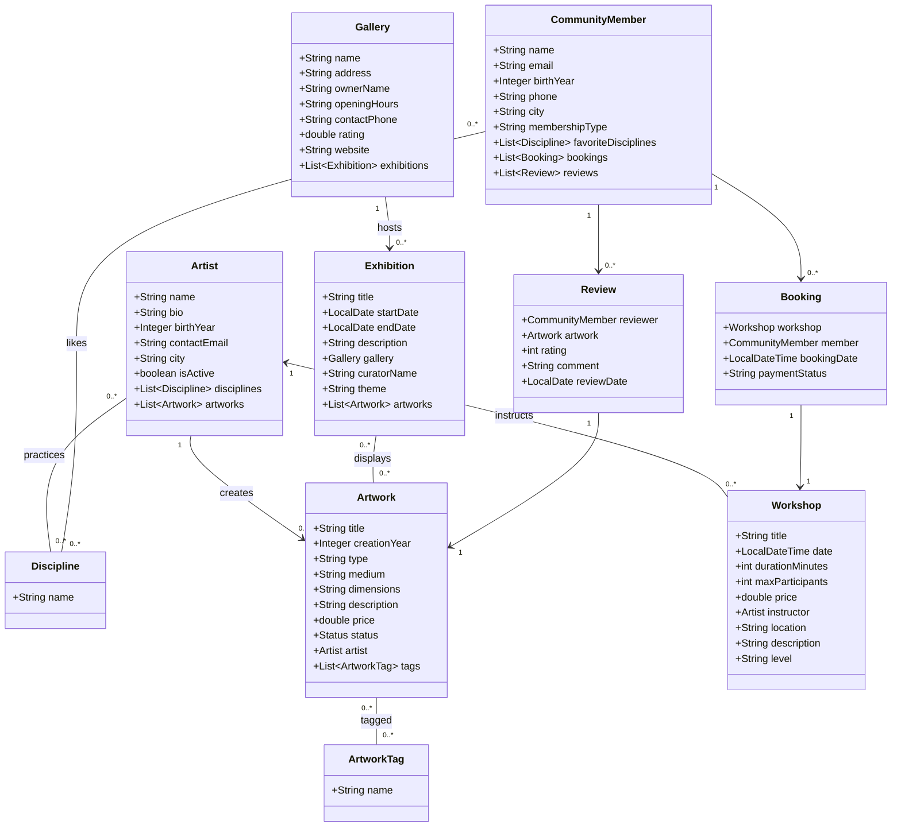
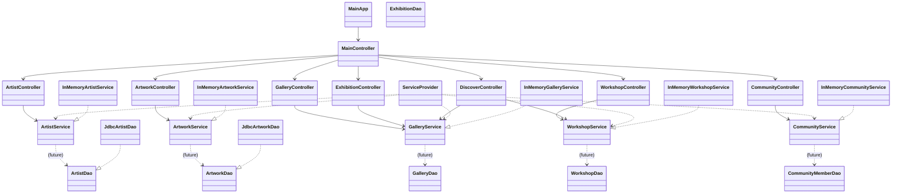

# ArtConnect Pro — Step 1 : Understanding & Functional Scope (02/04/2026)

## 1) Exploration de l’application fournie

### Import & exécution (as-is)
- Projet Maven / Java 17+.
- Lancement : `mvn clean javafx:run`.
- L’application démarre en **mode In-Memory** via `ServiceProvider` (services `InMemory*` + données factices).

### Écrans principaux (UI)
L’UI est une fenêtre JavaFX composée d’un `TabPane` (onglets) + menu.

**Menu**
- File → Exit
- Help → About (présent mais sans action spécifique)

**Onglets (7)**
1. **Discover** : cartes “Featured Exhibitions” + “Upcoming Workshops” (générées par code)
2. **Artists** : tableau + recherche + filtre discipline + reset
3. **Artworks** : tableau (titre, artiste, type, prix, statut)
4. **Galleries** : liste avec résumé (nom, adresse, note)
5. **Exhibitions** : tableau (titre, galerie, date de début, thème)
6. **Workshops** : tableau (titre, instructeur, date, prix, niveau)
7. **Community** : tableau (nom, email, ville)


## 2) Analyse fonctionnelle (vision “utilisateur”)

### 2.1 Fonctionnalités visibles dans l’interface (actuel)
Légende :
- **[EXISTANT]** déjà dans l’interface fournie
- **[PRÉVU]** logique métier présente / visée, mais pas d’écran UI (ou évolution souhaitée)

**Découvrir / Consulter**
- **[EXISTANT]** Voir une sélection (“featured”) d’expositions et d’ateliers dans **Discover**
- **[EXISTANT]** Consulter la liste des artistes
- **[EXISTANT]** Rechercher un artiste par nom (champ texte)
- **[EXISTANT]** Filtrer les artistes par discipline (combo)
- **[EXISTANT]** Réinitialiser la recherche/filtre
- **[EXISTANT]** Consulter la liste des œuvres (avec artiste et statut)
- **[EXISTANT]** Consulter la liste des galeries (avec adresse et rating)
- **[EXISTANT]** Consulter la liste des expositions (avec galerie et thème)
- **[EXISTANT]** Consulter la liste des ateliers (avec instructeur, date, niveau)
- **[EXISTANT]** Consulter la liste des membres de la communauté

**Gérer (non exposé en UI actuellement)**
- **[PRÉVU]** Créer / modifier / supprimer des artistes (méthodes `ArtistService`)
- **[PRÉVU]** Créer / modifier / supprimer des œuvres (méthodes `ArtworkService`)
- **[PRÉVU]** Créer / modifier / supprimer des expositions (DAO `ExhibitionDao`)
- **[PRÉVU]** Réserver un atelier (méthode `WorkshopService.bookWorkshop`) + consulter ses réservations
- **[PRÉVU]** Ajouter/consulter des avis (reviews) sur une œuvre (modèle `Review`, `CommunityService.getReviewsByMember`)


### 2.2 Rôles / profils utilisateurs (conceptuels)
Même si l’authentification n’existe pas encore, on peut définir des acteurs métiers.

- **Visiteur** : consulte le contenu public (artistes, œuvres, galeries, expositions, ateliers, “discover”).
- **Organisateur / Administrateur** : maintient les données (création/mise à jour artistes, œuvres, expositions, ateliers, galeries).

(Optionnellement, pour une vision plus fine : **Artiste** (gère son portfolio), **Membre** (réserve/évalue), **Propriétaire de galerie** (gère expositions).)


### 2.3 Diagramme de cas d’utilisation (UML)
Le diagramme ci-dessous décrit la **cible** (features “target”).
Les cas marqués `<<EXISTANT>>` correspondent à l’interface actuelle.

```plantuml
@startuml
left to right direction
skinparam packageStyle rectangle

actor "Visiteur" as Visitor
actor "Organisateur/Administrateur" as Admin

rectangle "ArtConnect Pro" {

  (Consulter contenu Discover) as UC_Discover
  (Consulter artistes) as UC_ViewArtists
  (Rechercher artiste) as UC_SearchArtist
  (Filtrer artistes par discipline) as UC_FilterArtist
  (Consulter œuvres) as UC_ViewArtworks
  (Consulter galeries) as UC_ViewGalleries
  (Consulter expositions) as UC_ViewExhibitions
  (Consulter ateliers) as UC_ViewWorkshops
  (Consulter membres) as UC_ViewMembers

  (Gérer artistes (CRUD)) as UC_ManageArtists
  (Gérer œuvres (CRUD)) as UC_ManageArtworks
  (Gérer expositions (CRUD)) as UC_ManageExhibitions
  (Réserver un atelier) as UC_BookWorkshop
  (Consulter ses réservations) as UC_ViewBookings
  (Rédiger un avis sur une œuvre) as UC_WriteReview
}

Visitor --> UC_Discover : <<EXISTANT>>
Visitor --> UC_ViewArtists : <<EXISTANT>>
Visitor --> UC_SearchArtist : <<EXISTANT>>
Visitor --> UC_FilterArtist : <<EXISTANT>>
Visitor --> UC_ViewArtworks : <<EXISTANT>>
Visitor --> UC_ViewGalleries : <<EXISTANT>>
Visitor --> UC_ViewExhibitions : <<EXISTANT>>
Visitor --> UC_ViewWorkshops : <<EXISTANT>>
Visitor --> UC_ViewMembers : <<EXISTANT>>

Admin --> UC_ManageArtists : <<PRÉVU>>
Admin --> UC_ManageArtworks : <<PRÉVU>>
Admin --> UC_ManageExhibitions : <<PRÉVU>>

Visitor --> UC_BookWorkshop : <<PRÉVU>>
Visitor --> UC_ViewBookings : <<PRÉVU>>
Visitor --> UC_WriteReview : <<PRÉVU>>

UC_SearchArtist ..> UC_ViewArtists : <<include>>
UC_FilterArtist ..> UC_ViewArtists : <<include>>
UC_ViewBookings ..> UC_BookWorkshop : <<extend>>

@enduml
```


## 3) Static design (architecture + modèles)

### 3.1 Lecture du README & architecture globale
- Application JavaFX en **architecture en couches** : UI → Services → DAO → Persistence (JDBC) → MySQL.
- Version fournie : persistance JDBC non implémentée (stubs `UnsupportedOperationException`), données factices via `InMemory*`.
- Particularité : **modèle OOP-first** (pas d’ID dans les classes Java). Les IDs existent côté base et sont “reconstruits” lors du mapping JDBC.


### 3.2 Diagramme de classes — Modèle métier (domain)
Ce diagramme représente les principales entités et leurs relations.




### 3.3 Diagramme de classes — Structure du code (couches)
Diagramme simplifié (dépendances principales) :




## 4) Périmètre base de données (scope exact à implémenter)
Objectif : couvrir **tout ce qui est visible dans l’UI** en persistance (Phase 1), puis prévoir des extensions cohérentes (Phase 2).

### Phase 1 — Scope DB (couvre l’UI actuelle)
- **Artist** (+ disciplines)
- **Discipline**
- **Artwork** (+ statut, référence vers Artist)
- **Gallery**
- **Exhibition** (référence vers Gallery) + association **Exhibition–Artwork**
- **Workshop** (référence vers Artist “instructor”)
- **CommunityMember**

➡️ Cela permet de persister les 7 onglets (Discover étant un “mix” d’exhibitions + workshops).

### Phase 2 — Évolutions (hors UI actuelle, mais déjà présentes dans le modèle/service)
- **Booking** (CommunityMember ↔ Workshop)
- **Review** (CommunityMember ↔ Artwork)
- **ArtworkTag** + association Artwork–Tag
- Favoris de disciplines (CommunityMember ↔ Discipline)


---
### Notes importantes pour la conception DB
- Les classes Java n’ayant pas d’ID, la base **devra** en avoir (PK auto-incrémentées) et les DAOs JDBC devront reconstruire les liens (Artist ↔ Artwork, etc.).
- Les relations de type *many-to-many* (ex. Exhibition–Artwork, Artist–Discipline) nécessiteront typiquement des tables d’association côté DB, même si le modèle Java utilise des listes.
